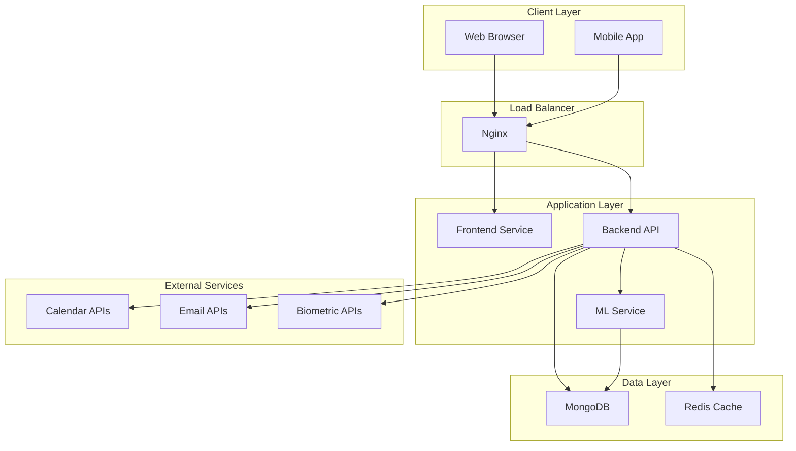

# System Architecture Documentation

**Created by Balaji Koneti**

## Overview

The Burnout Risk Prediction System is a comprehensive, AI-powered platform designed to predict and prevent burnout in hybrid and remote teams. The system employs a microservices architecture with real-time data processing, machine learning models, and personalized recommendations.

## High-Level Architecture



## Component Architecture

### 1. Frontend Service (React/TypeScript)

**Purpose**: User interface and user experience layer

**Technology Stack**:
- React 18 with TypeScript
- Vite for build tooling
- Tailwind CSS for styling
- Recharts for data visualization
- React Router for navigation

**Key Components**:
- `Dashboard`: Main overview interface
- `RiskCard`: Risk assessment display
- `Chart`: Data visualization components
- `RecommendationList`: Personalized suggestions
- `Login`: Authentication interface

**Responsibilities**:
- User interface rendering
- User interaction handling
- Data visualization
- State management
- API communication

### 2. Backend API Service (Node.js/TypeScript)

**Purpose**: Business logic, data processing, and API endpoints

**Technology Stack**:
- Node.js with Express.js
- TypeScript for type safety
- MongoDB with Mongoose ODM
- JWT for authentication
- Winston for logging

**Key Modules**:
- `AuthController`: User authentication and authorization
- `PredictionController`: Risk prediction endpoints
- `MetadataController`: System information
- `UserService`: User management logic
- `PredictionService`: Risk calculation logic

**API Endpoints**:
```
Authentication:
POST /api/auth/register
POST /api/auth/login
GET  /api/auth/profile
PUT  /api/auth/profile

Predictions:
POST /api/predictions
GET  /api/predictions/latest
GET  /api/predictions/history
GET  /api/predictions/stats

Metadata:
GET  /api/health
GET  /api/info
GET  /api/models
```

**Responsibilities**:
- API endpoint management
- Business logic implementation
- Data validation and sanitization
- Authentication and authorization
- Integration with ML service

### 3. ML Service (Python)

**Purpose**: Machine learning model training, evaluation, and prediction

**Technology Stack**:
- Python 3.9
- Scikit-learn for traditional ML
- TensorFlow for deep learning
- Pandas for data processing
- NumPy for numerical computing
- Optuna for hyperparameter optimization

**Key Modules**:
- `preprocess.py`: Data preprocessing and feature engineering
- `train.py`: Model training and hyperparameter optimization
- `evaluate.py`: Model evaluation and performance metrics
- `predict.py`: Real-time prediction service

**ML Pipeline**:
1. **Data Collection**: Calendar events, emails, surveys
2. **Preprocessing**: Cleaning, feature engineering, scaling
3. **Training**: Multiple algorithms with cross-validation
4. **Evaluation**: Comprehensive performance assessment
5. **Deployment**: Model serving and prediction API

**Models Implemented**:
- Random Forest Classifier
- Gradient Boosting Classifier
- Support Vector Machine
- Neural Network (TensorFlow)
- Ensemble Methods

### 4. Database Layer

#### MongoDB (Primary Database)
**Purpose**: Store application data and user information

**Collections**:
- `users`: User accounts and profiles
- `calendarEvents`: Calendar event data
- `emailMessages`: Email analysis data
- `predictionResults`: ML prediction results

**Indexing Strategy**:
- User ID indexes for fast lookups
- Timestamp indexes for time-series queries
- Compound indexes for complex queries

#### Redis Cache
**Purpose**: Session management and caching

**Use Cases**:
- User session storage
- API response caching
- Rate limiting counters
- Temporary data storage

## Data Flow Architecture

### 1. User Registration/Login Flow
```
User → Frontend → Backend API → MongoDB
                ↓
            JWT Token → Frontend
```

### 2. Data Collection Flow
```
External APIs → Backend API → Data Processing → MongoDB
                                    ↓
                            Feature Extraction → ML Service
```

### 3. Prediction Flow
```
User Request → Frontend → Backend API → ML Service
                                    ↓
                            Model Prediction → Backend API
                                    ↓
                            Results + Recommendations → Frontend
```

### 4. Real-time Updates Flow
```
Data Sources → Backend API → Feature Extraction
                                    ↓
                            Risk Calculation → Database
                                    ↓
                            WebSocket/SSE → Frontend
```

## Security Architecture

### Authentication & Authorization
- **JWT Tokens**: Stateless authentication
- **Password Hashing**: bcrypt with salt rounds
- **Role-based Access**: User, Manager, Admin roles
- **Session Management**: Redis-based session storage

### API Security
- **Rate Limiting**: Request throttling per IP/user
- **CORS Protection**: Cross-origin request validation
- **Input Validation**: Data sanitization and validation
- **Helmet Security**: HTTP security headers

### Data Security
- **Encryption at Rest**: Database encryption
- **Encryption in Transit**: HTTPS/TLS
- **Data Anonymization**: PII protection
- **Access Logging**: Audit trail maintenance

## Scalability Architecture

### Horizontal Scaling
- **Load Balancing**: Nginx round-robin
- **Container Orchestration**: Docker Compose
- **Database Sharding**: MongoDB sharding strategy
- **Microservices**: Independent service scaling

### Performance Optimization
- **Caching Strategy**: Multi-level caching
- **Database Indexing**: Optimized query performance
- **CDN Integration**: Static asset delivery
- **Compression**: Gzip response compression

### Monitoring & Observability
- **Health Checks**: Service health monitoring
- **Logging**: Centralized log aggregation
- **Metrics**: Performance and business metrics
- **Alerting**: Automated incident response

## Deployment Architecture

### Development Environment
```
Local Machine:
├── Frontend (Vite Dev Server)
├── Backend (Node.js Dev Server)
├── ML Service (Python Dev Server)
└── MongoDB (Local Instance)
```

### Production Environment
```
Docker Containers:
├── Nginx (Reverse Proxy)
├── Frontend (Static Files)
├── Backend (Node.js API)
├── ML Service (Python API)
├── MongoDB (Database)
└── Redis (Cache)
```

### CI/CD Pipeline
```
Code Push → GitHub Actions → Build → Test → Deploy
```

## Integration Architecture

### External API Integrations
- **Calendar APIs**: Google Calendar, Outlook
- **Email APIs**: Gmail, Outlook Mail
- **Biometric APIs**: Health tracking devices
- **Survey APIs**: Employee feedback systems

### Data Synchronization
- **Real-time Sync**: WebSocket connections
- **Batch Processing**: Scheduled data updates
- **Event-driven**: Trigger-based updates
- **Manual Refresh**: User-initiated updates

## Error Handling Architecture

### Error Types
- **Client Errors**: 4xx HTTP status codes
- **Server Errors**: 5xx HTTP status codes
- **Validation Errors**: Input validation failures
- **Business Logic Errors**: Domain-specific errors

### Error Handling Strategy
- **Graceful Degradation**: Fallback mechanisms
- **Error Logging**: Comprehensive error tracking
- **User Feedback**: Clear error messages
- **Retry Logic**: Automatic retry mechanisms

## Future Architecture Considerations

### Planned Enhancements
- **Kubernetes**: Container orchestration
- **Message Queues**: Asynchronous processing
- **Event Streaming**: Real-time data processing
- **Machine Learning Pipeline**: MLOps integration

### Scalability Improvements
- **Microservices**: Further service decomposition
- **API Gateway**: Centralized API management
- **Service Mesh**: Inter-service communication
- **Cloud Native**: Cloud platform migration

## Technology Decisions

### Frontend Framework: React
**Rationale**: 
- Large ecosystem and community
- Excellent TypeScript support
- Rich component libraries
- Strong performance characteristics

### Backend Framework: Node.js/Express
**Rationale**:
- JavaScript/TypeScript consistency
- Large package ecosystem
- Excellent MongoDB integration
- High performance for I/O operations

### Database: MongoDB
**Rationale**:
- Flexible schema for varying data types
- Excellent horizontal scaling
- Rich query capabilities
- Strong TypeScript integration

### ML Framework: Python/Scikit-learn
**Rationale**:
- Mature ML ecosystem
- Extensive algorithm library
- Excellent data processing tools
- Strong community support

## Performance Characteristics

### Response Times
- **API Endpoints**: < 200ms average
- **ML Predictions**: < 500ms average
- **Database Queries**: < 100ms average
- **Frontend Rendering**: < 100ms average

### Throughput
- **Concurrent Users**: 1000+ users
- **API Requests**: 10,000+ requests/minute
- **Database Operations**: 50,000+ operations/minute
- **ML Predictions**: 1,000+ predictions/minute

### Resource Usage
- **Memory**: 2GB per service container
- **CPU**: 1-2 cores per service
- **Storage**: 100GB+ for data and models
- **Network**: 1Gbps bandwidth

This architecture provides a robust, scalable, and maintainable foundation for the Burnout Risk Prediction System, ensuring high performance, security, and user experience while supporting future growth and enhancements.
